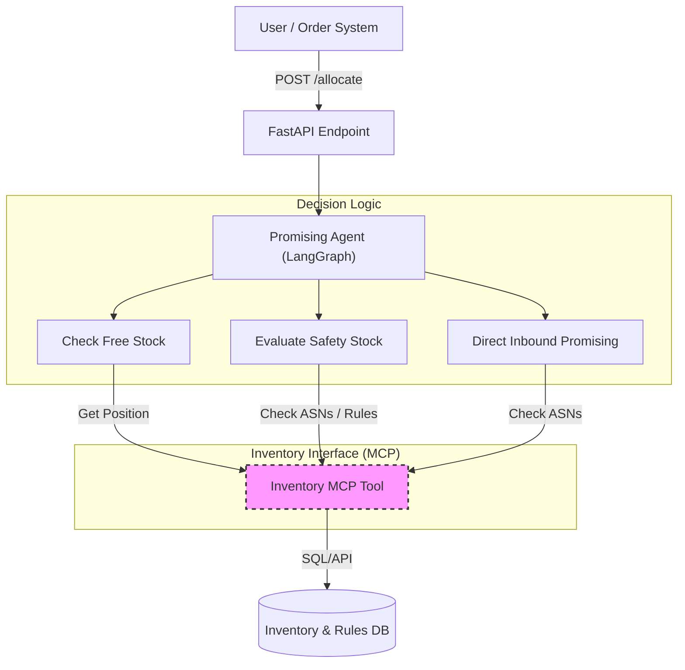
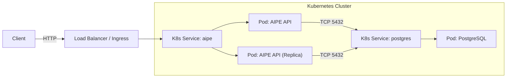

# Agentic Inbound Promising Engine (AIPE)

AIPE is an intelligent supply chain agent designed to optimize order promising by dynamically leveraging "Future Inventory" (Inbound ASNs) and managing "Safety Stock" with risk-aware strategies.

## The Business Problem
In modern supply chains, fulfilling orders solely from "Free On-Hand Stock" leaves money on the table.
- **Lost Sales**: Rejecting orders when a replenishment truck is arriving tomorrow.
- **Static Safety Stock**: Holding high safety stock (buffer) unnecessarily when replenishment is reliable.
- **Inflexible Promising**: Inability to "borrow" against future stock or lock specific inbound units for high-priority orders.

## The Solution: Agentic Promising
AIPE uses a **LangGraph**-based Agent to evaluate inventory sources in a prioritized decision tree:

### Logical Architecture


1.  **Free On-Hand**: Allocate immediately if physical stock exists above safety levels.
2.  **Safety Stock (Borrow & Repay)**: dynamically "borrow" from safety stock **IF** a qualifying replenishment (ASN) is arriving within a configured window (e.g., 5 days). The borrowed amount is strictly "locked" against the future ASN to ensure repayment.
3.  **Risky Depletion**: If enabled via business rules, allow borrowing even without immediate replenishment for high-priority items.
4.  **Direct Inbound**: If on-hand is exhausted, promise directly against a future ASN (Backorder with specific ETA).

## Modular Architecture
This service is built with a loose coupling between the **Decision Engine** (The Agent) and the **Inventory System of Record**.

### Pluggable Inventory Interface
Currently, the system uses a local `inventory_mcp` module (implementing the Model Context Protocol) to talk to a PostgreSQL database.

**In a real production environment**, this module can be replaced by **ANY** external service adapter:
- **SAP / Oracle ERP**: Query live ATP (Available to Promise).
- **Blue Yonder / Manhattan**: Query WMS inventory positions.
- **Custom Legacy Systems**: Mainframe wrappers.

**Contract Requirement**:
As long as the external service can provide the following tools/interfaces, the Agent logic remains unchanged:
- `get_inventory_position(sku)`
- `get_inbound_asns(sku)`
- `execute_allocation(order_id, sku, strategy, ...)`

## Tech Stack
-   **Logic**: Python 3.11, LangGraph.
-   **API**: FastAPI.
-   **Database**: PostgreSQL (Production), SQLite (Dev).
-   **Deployment**: Docker, Kubernetes.

## Getting Started

### Local Development
1.  Install dependencies:
    ```bash
    pip install -r requirements.txt
    ```
2.  Run tests:
    ```bash
    pytest tests/test_scenarios.py
    ```

### Production Deployment (Kubernetes)
See [deployment_guide.md](deployment_guide.md) for full details.

### Infrastructure Diagram


```bash
kubectl apply -f k8s/postgres.yaml
kubectl apply -f k8s/app.yaml
```
